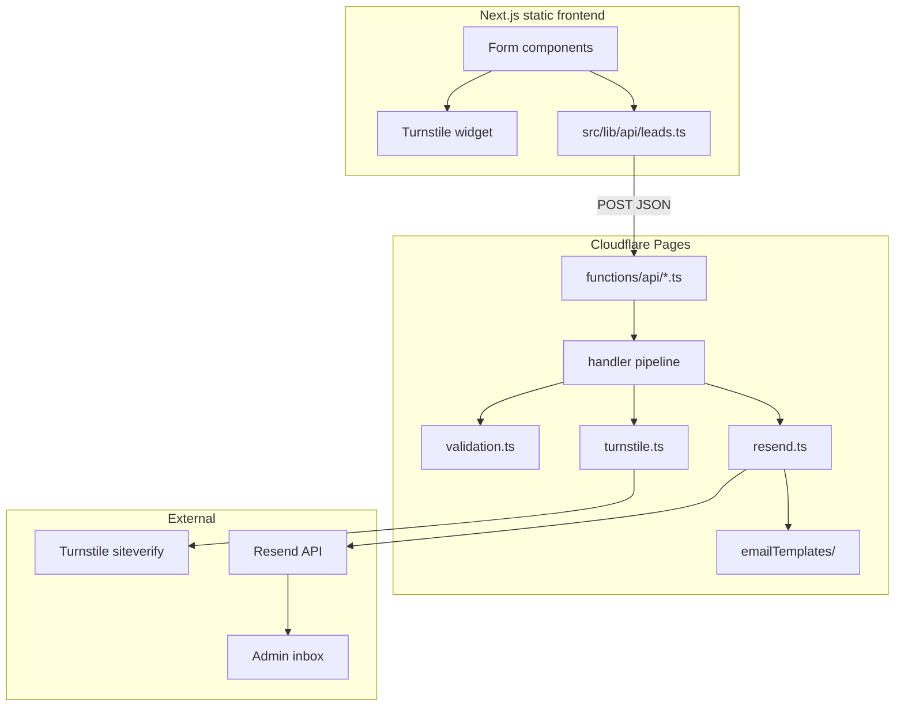

# Backend Architecture

## Request flow



## Client vs server code

**Critical rule:** secrets and server-only logic live under `functions/`, never in `src/` (static bundle is public).

| Location | Runs on | Contains |
|----------|---------|----------|
| `functions/_shared/` | Cloudflare Workers | Resend, Turnstile verify, validation, HTML templates |
| `functions/api/` | Cloudflare Workers | Route handlers (`POST /api/contact`, etc.) |
| `src/lib/api/` | Browser | `fetch` wrappers, no secrets |
| `src/types/leads.ts` | Shared types | Payload TypeScript interfaces (no secrets) |
| `src/components/` | Browser | Forms + Turnstile widget |

Do **not** put `resend.ts` or Turnstile secret verification in `src/lib/` for production.

## Target folder structure

```
EYF/
├── functions/                          # Cloudflare Pages Functions (server-only)
│   ├── _shared/
│   │   ├── cors.ts
│   │   ├── response.ts                 # jsonSuccess / jsonError
│   │   ├── env.ts                      # typed env access
│   │   ├── validation.ts               # per-workflow schemas
│   │   ├── turnstile.ts
│   │   ├── resend.ts                   # fetch → Resend REST API
│   │   ├── handler.ts                  # createLeadHandler(...)
│   │   └── emailTemplates/
│   │       ├── layout.ts               # base responsive HTML shell
│   │       ├── contact.ts
│   │       ├── volunteer.ts
│   │       ├── newsletter.ts
│   │       ├── donation.ts
│   │       └── support.ts
│   └── api/
│       ├── contact.ts                  # → POST /api/contact
│       ├── volunteer.ts
│       ├── newsletter.ts
│       ├── donation.ts
│       └── support.ts
│
├── src/                                # Next.js static frontend
│   ├── lib/
│   │   └── api/
│   │       └── leads.ts                # submitContact(), submitVolunteer(), ...
│   ├── types/
│   │   └── leads.ts
│   ├── components/
│   │   ├── ui/TurnstileWidget.tsx      # replaces TurnstileSlot
│   │   └── sections/                   # forms wired to lib/api
│   └── ...
│
├── wrangler.toml
├── .dev.vars                           # local secrets (gitignored)
└── env.example
```

## Handler pipeline (Phase 3+)

Every lead route should use the same pipeline:

```
OPTIONS  → CORS preflight
POST only
  → parse JSON body
  → verify Turnstile token
  → validate payload (schema)
  → build HTML from template
  → send admin email via Resend
  → return structured JSON response
```

Factory pattern:

```ts
// functions/_shared/handler.ts (conceptual)
createLeadHandler({
  schema: contactSchema,
  subject: (data) => `[EYF Contact] ${data.name}`,
  renderEmail: renderContactEmail,
});
```

## Cloudflare Pages routing

| File | URL |
|------|-----|
| `functions/api/contact.ts` | `POST /api/contact` |
| `functions/api/volunteer.ts` | `POST /api/volunteer` |
| `functions/api/newsletter.ts` | `POST /api/newsletter` |
| `functions/api/donation.ts` | `POST /api/donation` |
| `functions/api/support.ts` | `POST /api/support` |

Optional later: `functions/_middleware.ts` for global security headers.

## Build and deploy

1. `npm run build` → static site in `out/`
2. Cloudflare Pages deploys `out/` + auto-discovers `functions/`
3. `wrangler.toml` must set `pages_build_output_dir = "out"`

**Do not** rely on Next.js API routes (`app/api/*`) with `output: "export"`.

**Note:** `@cloudflare/next-on-pages` is deprecated. This project uses **static export + Pages Functions**, not OpenNext adapter.

## Email-only lead management

- Each submission sends one **admin notification** email.
- Optional later: auto-reply to the submitter (Phase 5).
- No database writes; admin inbox is the system of record.
- Optional duplicate notify: existing `src/services/slack.ts` webhook (Phase 5, optional).

## Dependencies (when implementing)

| Package | Where | Purpose |
|---------|-------|---------|
| `@marsidev/react-turnstile` | Frontend | Turnstile widget |
| `zod` (optional) | `functions/_shared` | Server-side validation |

Resend on the edge: use **`fetch`** to `https://api.resend.com/emails` — no Node Resend SDK required in Workers.
